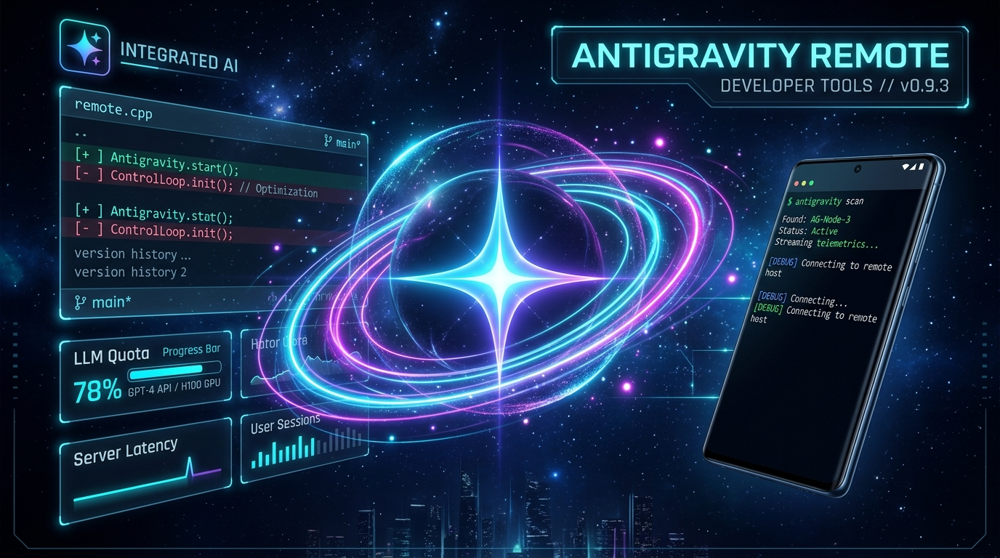
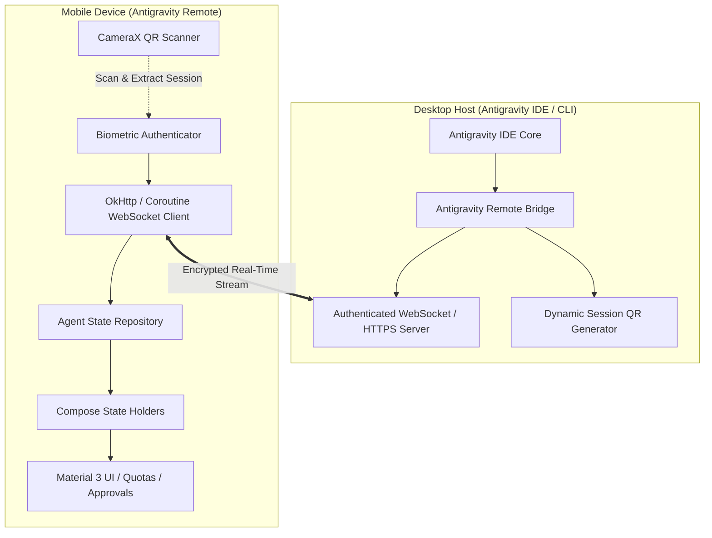

<div align="center">



# 🚀 Antigravity Remote

**The Next-Generation Mobile Companion & Telemetry Console for Antigravity AI**

[](https://github.com/Densuper/AntigravityRemote/releases/latest)
[](https://github.com/Densuper/AntigravityRemote/releases/download/v1.0.0/AntigravityRemote-v1.0.0.apk)
[](https://opensource.org/licenses/MIT)

<br/>

[-blue.svg)](https://developer.android.com)
[](https://developer.android.com/guide/practices/page-sizes)
[](https://kotlinlang.org)
[](https://developer.android.com/jetpack/compose)

---

### 📲 [⚡ **Download Latest Release (v1.0.0 APK)** ⚡](https://github.com/Densuper/AntigravityRemote/releases/tag/v1.0.0)

Monitor AI agent workflows, review diffs, approve tool executions, and track real-time LLM token quotas directly from your Android phone with zero latency.

</div>

---

## 🌟 Key Features

- 📷 **Instant CameraX QR Pairing**: Zero-configuration setup. Scan the dynamic QR code displayed on your Antigravity IDE terminal/companion to securely bind mobile and desktop hosts via encrypted handshakes.
- 🔒 **Biometric Security & Hardware Keystore**: Protect your agent remote controls and approvals behind hardware-backed Android `BiometricPrompt` (Fingerprint & Face Unlock) with cryptographic token storage.
- ⚡ **Real-Time Live Agent Streaming**: Track multi-turn subagent execution, terminal commands, workspace edits, and background tasks in real time over low-latency WebSockets.
- 📊 **Model Quotas & Token Telemetry**: Dedicated dashboard tracking daily/monthly LLM quotas, context window consumption, cache hits, and rate limits across models.
- 🎙️ **On-Device Voice Assistant & Spoken Briefings**: Native on-device Text-to-Speech (TTS) integration that delivers spoken agent summaries, task execution updates, and project status directly to the device speaker or connected headphones without disturbing desktop audio.
- 🔔 **Full Chromium WebPush & Lockscreen Sync**: Multi-stream EventSource, WebSocket, ServiceWorker, and Blue Dot unread indicators with zero-redaction lockscreen notifications.
- 📱 **Android 15 Ready (16KB Memory Page Support)**: Built and verified with 16KB ELF page size alignment for next-gen Android 15 performance and battery efficiency.
- 🎨 **Modern Material You & Jetpack Compose**: Full dynamic theme support, edge-to-edge UI, dark mode, smooth gesture animations, and haptic feedback.

---

## 🏗️ Architecture Overview



---

## 🛠️ Tech Stack & Dependencies

- **Language**: Kotlin 2.0+
- **UI Framework**: Jetpack Compose, Material 3, Edge-to-Edge Navigation
- **Camera & Scanning**: AndroidX CameraX (`camera-camera2`, `camera-lifecycle`, `camera-view`), Google ML Kit Barcode Scanning
- **Security**: AndroidX Biometric (`androidx.biometric:biometric`), Android KeyStore Provider
- **Networking**: OkHttp 4, Kotlinx Coroutines & Flow, Moshi / Kotlinx Serialization
- **Target OS**: Android 8.0 (API 26) through Android 15 (API 35, 16KB Page Compatible)

---

## 🚀 Quickstart Guide

### Prerequisites
1. Android device running Android 8.0 (Oreo) or later.
2. PC / Mac running Google Antigravity IDE or Antigravity CLI.

### 1. Running the Android Application

#### Option A: Download Pre-built APK
Download the latest `AntigravityRemote-v1.0.0.apk` from the **[GitHub Releases](https://github.com/Densuper/AntigravityRemote/releases)** tab.

#### Option B: Build from Source
```bash
# Clone the repository
git clone https://github.com/Densuper/AntigravityRemote.git
cd AntigravityRemote

# Build debug APK using Gradle wrapper
# On Linux/macOS:
./gradlew assembleDebug

# On Windows:
gradlew.bat assembleDebug
```
The resulting APK will be located at:
`app/build/outputs/apk/debug/app-debug.apk`

### 2. Pairing with Antigravity Desktop

1. Open your Antigravity IDE workspace or start the remote server from the Antigravity companion interface.
2. Launch **Antigravity Remote** on your Android device.
3. Tap **Scan QR Code** and point your camera at the screen QR code.
4. Verify with your fingerprint / face ID when prompted.
5. Your live session dashboard, agent execution queue, and quota indicators are now active!

---

## 🔒 Security & Privacy

- **Local Network Priority**: Session pairing and real-time streaming operate peer-to-peer over local network channels or end-to-end encrypted tunnels.
- **Biometric Enclave**: Sensitive session credentials and auth tokens are stored encrypted in the Android Hardware Keystore and cleared on disconnect.
- **Zero Third-Party Telemetry**: Your code snippets, diffs, agent prompts, and responses remain strictly private to your machine and paired mobile device.

---

## 🤝 Contributing

We welcome contributions from the open-source community! Please review our [CONTRIBUTING.md](CONTRIBUTING.md) guide for instructions on filing issues, submitting pull requests, and setting up the development environment.

---

## 📄 License

Antigravity Remote is licensed under the **[MIT License](LICENSE)**.

Copyright &copy; 2026 Denver Colaco. All rights reserved.
